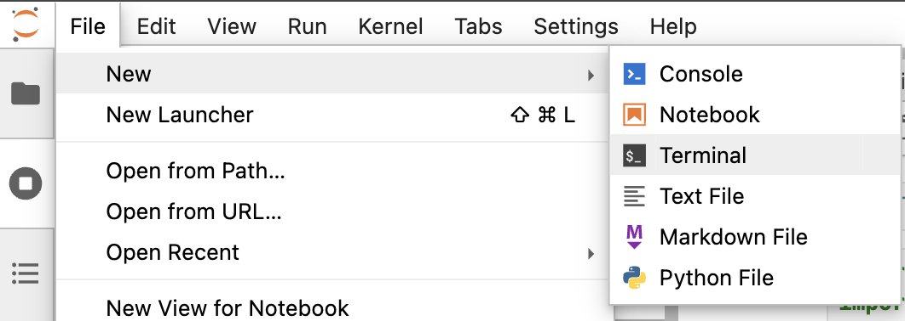
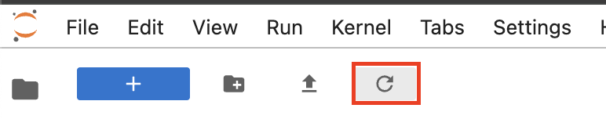
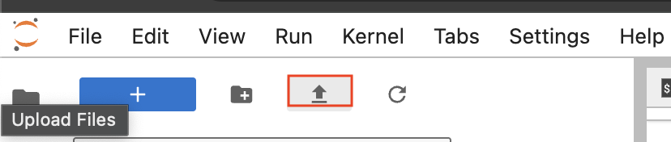
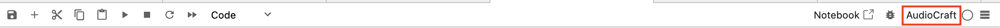
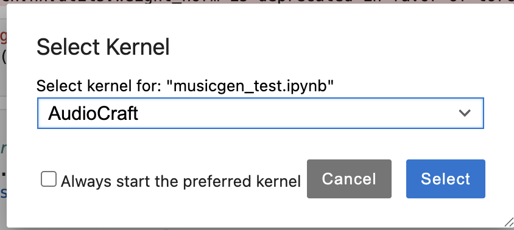

# MusicGen Example

An AI-powered MPC sampler that uses Meta's MusicGen model to generate audio samples from text prompts.

## Overview

This project uses AI to simulate loading samples onto a sampler, each sampler pad has a prompt box for you to write what should be the vibe of that pad, once all the prompt boxes are populated, you can start generating and each pad will be populated by samples generated by MusicGen.

## Getting Started

### Backend Setup

**Note:** For running on the ITP machine or other jupyterlab environments, it's recommended to import only the backend notebook rather than cloning the entire repository. This keeps your workspace clean and avoids unnecessary files.

1. **Start Jupyter Lab and Open Terminal**
   - After logging into Jupyter Lab, click **File** at the top menu
   - In the dropdown menu, click **New Terminal**
   

2. **Create Project Directory**
   - In the terminal, create a new directory for your project:
   ```bash
   mkdir musicgen-project
   cd musicgen-project
   ```

3. **Upload the Files**
   - Go back to the Jupyter Lab file browser
   - Navigate to the `musicgen-project` folder you just created in the left sidebar
   - If you don't see your newly created folder, click the refresh button in the toolbar
   
   - Click the **Upload Files** button in the toolbar
   
   - Upload both the `musicgen_web.ipynb` and `requirements.txt` files from the backend directory of this repository
   - Once uploaded, you'll see them in your project directory

4. **Create Conda Environment**
   - Return to the terminal and create a new conda environment:
   ```bash
   conda create -n musicgen python=3.9
   ```
   - Activate the environment:
   ```bash
   conda activate musicgen
   ```

5. **Install Requirements**
   - Install the required packages:
   ```bash
   pip install -r requirements.txt
   ```

6. **Create Jupyter Kernel**
   - Install ipykernel in your conda environment:
   ```bash
   pip install ipykernel
   ```
   - Register the environment as a Jupyter kernel:
   ```bash
   python -m ipykernel install --user --name musicgen --display-name "MusicGen"
   ```

   **Why this step is needed:** Jupyter needs to know which Python environment to use when running your notebook. By creating a kernel, you're telling Jupyter "use the Python and packages from my conda environment." Without this step, Jupyter would use the default Python installation, which won't have the required packages like audiocraft and torch that we just installed.

7. **Open and Configure Notebook**
   - Click on the uploaded `musicgen_web.ipynb` file in the left sidebar to open it

8. **Select Correct Kernel**
   - In the opened notebook, look for the kernel selector button in the top-right corner
   - Click the button with the circle icon to its right (next to the debug icon)
   
   - In the "Select Kernel" modal, choose "MusicGen" (or whatever name you gave your kernel during setup) from the dropdown
   
   - **Note:** If you don't see your newly created kernel in the dropdown, refresh the page once and try again
   - Click **Select** to confirm

9. **Run the Notebook**
   - You can run cells individually by:
     - Selecting a cell and pressing `Cmd+Enter` (Mac) or `Ctrl+Enter` (Windows/Linux)
     - Or clicking the play button in the toolbar
   - Enter your ngrok auth token when prompted
   - Note the public URL provided by ngrok

### Frontend Setup

You have several options to run the frontend:

**Option 1: Local Server (Recommended)**
1. Open terminal in VS Code:
   - Press `Ctrl+`` (backtick) or `Cmd+`` (Mac)
   - Or go to **Terminal** → **New Terminal** in the top menu
2. Navigate to the `sketch` directory:
   ```bash
   cd sketch
   ```
3. Start a simple Python server:
   ```bash
   python -m http.server 8000
   ```
   **Note:** If `python` doesn't work, try `python3 -m http.server 8000` instead
4. Open your browser and go to `http://localhost:8000`

**Option 2: VS Code Live Server**
1. Install the "Live Server" extension in VS Code
2. Right-click on `sketch/index.html` and select "Open with Live Server"

**Option 3: p5.js Web Editor**
1. Go to [p5.js Web Editor](https://editor.p5js.org/)
2. Create a new project
3. Copy the content from `sketch/index.html` into the HTML section
4. Copy the content from `sketch/sketch.js` into the JavaScript section
5. Create a new file called `musicgen.js` and copy the content from `sketch/musicgen.js`

**After Setup:**
1. Update the `apiUrl` variable in `musicgen.js` with your ngrok URL (e.g., `https://abc123.ngrok.io` - trailing slash is optional)
2. Enter prompts for each pad or use the defaults
3. Click "Generate All" to create your samples
4. After generation, use keyboard keys to play back samples:
   - Keys `1-9`: Play pads 1-9
   - Key `0`: Play pad 10
   - Key `-` or `_`: Play pad 11
   - Key `=` or `+`: Play pad 12